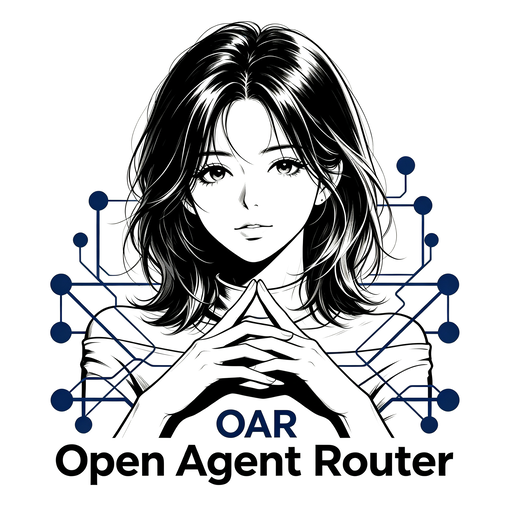
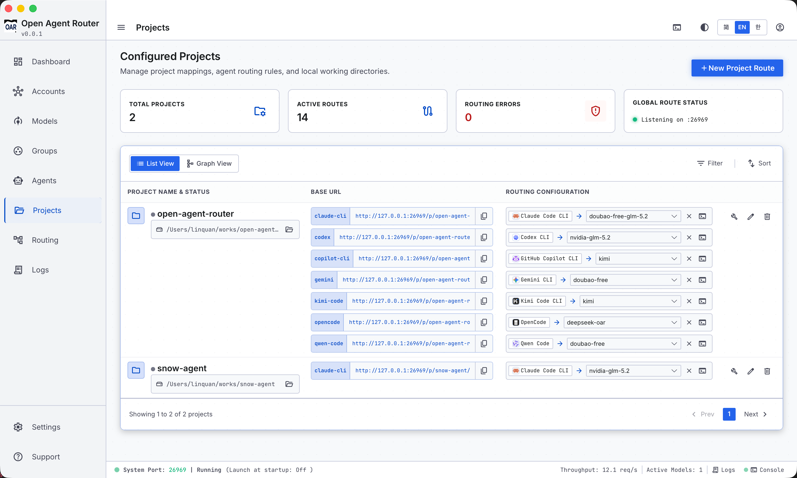

<div align="center">



<br/>

# Open Agent Router

### One Port. All Agents.

**A desktop AI agent routing manager. Per-project routing, configure accounts once and share across all agents. Built-in usage stats, request capture and auto-failover — one local port for every agent.**

<br/>

[](https://github.com/SnowAIGirl/open-agent-router/releases)
[](https://github.com/SnowAIGirl/open-agent-router/releases)
[](LICENSE)
[](https://www.open-agent-router.com)

<br/>

**English** · [中文](README_ZH.md) · [한국어](README_KO.md)

</div>

## 📸 Projects

<p align="center">
  
</p>

## 📥 Download

| Platform | Binary | Desktop App |
|----------|--------|-------------|
| macOS ARM64 | [oar-darwin-arm64](https://github.com/SnowAIGirl/open-agent-router/releases/latest) | [.dmg](https://github.com/SnowAIGirl/open-agent-router/releases/latest) |
| macOS x64 | [oar-darwin-x64](https://github.com/SnowAIGirl/open-agent-router/releases/latest) | — |
| Linux x64 | [oar-linux-x64](https://github.com/SnowAIGirl/open-agent-router/releases/latest) | [.deb](https://github.com/SnowAIGirl/open-agent-router/releases/latest) |
| Windows x64 | [oar-win-x64.exe](https://github.com/SnowAIGirl/open-agent-router/releases/latest) | [.msi](https://github.com/SnowAIGirl/open-agent-router/releases/latest) |

> Already installed? Run `oar update` to upgrade.

## 📊 At a Glance

| 11 Agents | 4 Protocols | 1 Port | 0 Cloud |
|-----------|-------------|--------|---------|

## ✨ Features

- **Lightweight & Local-first** — Single binary, ~50 MB. Runs entirely on localhost — zero cloud, zero telemetry. Your API keys never leave your machine.
- **Per-project Config, Once and Done** — Each project gets its own route. Configure once, switch groups or models from the UI without touching config files.
- **Group Auto-routing + Rate-limit Retry** — Model groups with weighted rotation, 429 cooldown, and automatic failover. When one model hits quota, OAR retries the next.
- **Mixed-provider Auto-switching** — Mix DeepSeek, OpenAI, Anthropic, and more in one group. When a provider fails, OAR auto-rotates — no manual intervention.
- **Model Alias / Ignore Client Names** — Agents send whatever model name they want. OAR maps it to the real upstream model via alias tables.
- **Keypool + Protocol Auto-adapt** — Multiple API keys per provider with weighted rotation. Anthropic ↔ OpenAI ↔ Responses ↔ Gemini — auto-detected and converted.
- **Dashboard & Analytics** — Request counts, token usage, success rates — by model, project, agent, or account. Time-range aware with trend charts.
- **Internationalized UI** — English, 中文, 한국어.

## 🚀 Quick Start

```
bash <(curl -fsSL https://oar-down.snow-agent.com/install.sh)
```

```bash
# Add an account
oar account create --name my-deepseek --platform deepseek --base-url https://api.deepseek.com --key sk-xxx

# Sync models
oar account sync my-deepseek

# Check status
oar status

# See all supported agents
oar agent list
```

## 🤖 Agent Matrix

| Agent | Protocol | Base URL |
|-------|----------|----------|
| **Claude Code** | Anthropic Messages | `/agent/claude/v1/messages` or `/project/xxx/v1/messages` |
| **Claude Desktop** | Anthropic Messages | `/agent/claude-desktop/v1/messages` or `/project/xxx/v1/messages` |
| **OpenAI Codex** | Codex Responses | `/group/coding/v1/completions` or `/project/xxx/v1/completions` |
| **Hermes** | OpenAI Chat Completions | `/project/xxx/v1/chat/completions` |
| **OpenClaw** | Custom | `/project/xxx/v1/chat/completions` |
| **Gemini CLI** | Google AI | `/project/xxx/v1/models` |
| **OpenCode** | OpenAI Chat Completions | `/project/xxx/v1/chat/completions` |
| **Kimi Code** | OpenAI Chat Completions | `/project/xxx/v1/chat/completions` |
| **Qwen Code** | OpenAI Chat Completions | `/project/xxx/v1/chat/completions` |
| **GitHub Copilot CLI** | OpenAI Chat Completions | `/project/xxx/v1/chat/completions` |

## 🔄 How a Request Flows

```
Request inbound → Protocol detect → Model select → Protocol convert → Upstream forward
```

1. Agent hits `localhost:26969` with a project/agent/group/model route.
2. Path identifies protocol: `/v1/chat/completions` = OpenAI, `/v1/messages` = Anthropic.
3. Memory cache resolves project → agent → group → model with alias mapping.
4. If upstream protocol differs, OAR adapts automatically.
5. Keypool picks a key by weight; failure auto-switches. SSE streaming passes through.

## ⚙️ All Commands

| Category | Command | Description |
|----------|---------|-------------|
| **Service** | `oar start` | Start proxy service on port 26969 |
| | `oar stop` | Stop the service |
| | `oar restart` | Restart the service |
| | `oar status` | Show service status |
| **Accounts** | `oar account list` | List upstream accounts |
| | `oar account create` | Add a provider account |
| | `oar account sync <id>` | Sync models from provider |
| **Groups** | `oar group list` | List model groups |
| | `oar group create --name` | Create a group |
| | `oar group add-model` | Add model to group |
| **Agents** | `oar agent list` | List agents and their groups |
| | `oar agent set-group` | Set agent's default group |
| | `oar agent regenerate` | Regenerate agent config |
| **Projects** | `oar project create` | Create a project |
| | `oar project add-agent` | Bind agent to project |
| | `oar open` | Launch agent in project context |
| **Settings** | `oar settings list / set` | View/change settings |
| | `oar update check / apply` | Self-update |

> Append `--json` to any command for machine-readable output.

## 🏗️ Architecture

```
oar                          Single binary, multiple modes
├── start                    Long-running proxy service (:26969)
├── update                   Self-update
├── status / account / ...   Management CLI

Core (TypeScript → Bun compile):
├── proxy/                   Request proxying + protocol conversion
├── server/                  Express HTTP server + admin API
├── config-manager/          Generate agent connection configs
├── service/                 Service management + auto-updater
├── db/                      SQLite config store
├── cache/                   In-memory route cache (zero SQLite on hot path)
└── i18n/                    Internationalization (en/zh-CN/ko)
```

## 📄 License

MIT

## 🙏 Credits

Inspired by [sub2api](https://github.com/Wei-Shaw/sub2api) and [cc-switch](https://github.com/farion1231/cc-switch).

## 💬 Community

- [Website](https://www.open-agent-router.com)
- [GitHub Issues](https://github.com/SnowAIGirl/open-agent-router/issues)
- [GitHub Discussions](https://github.com/SnowAIGirl/open-agent-router/discussions)
